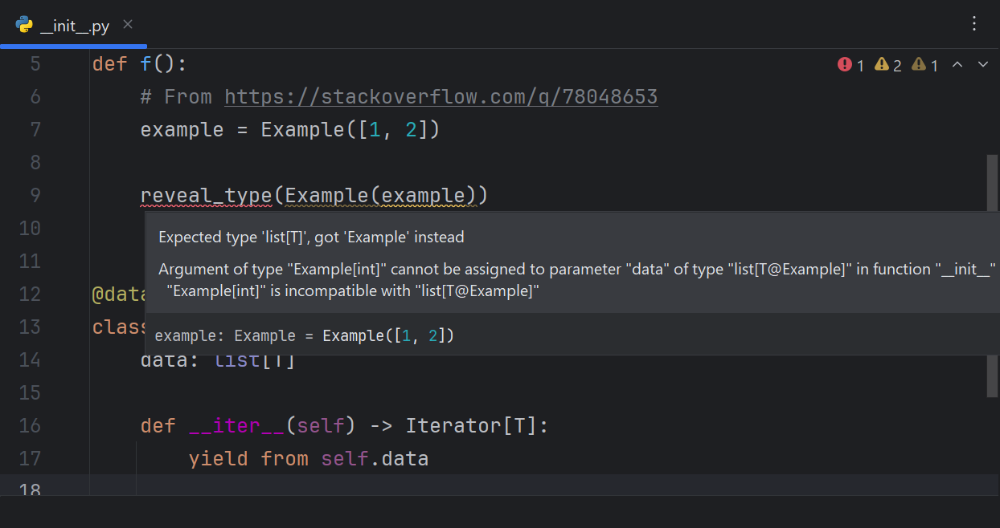

# Pyright for PyCharm

<!-- Plugin description -->
Pyright integration for PyCharm.

This plugin runs [the Pyright type checker][1] on-the-fly
as you edit your Python files.

It works by saving all your files as-is before running
the executable provided by you. If you are not OK with that,
please <em>do not</em> install this plugin.

User documentation can be found [here][2].

  [1]: https://github.com/microsoft/pyright
  [2]: https://insyncwithfoo.github.io/pyright-for-pycharm/
<!-- Plugin description end -->

## Installation

This plugin has not been published to [the Marketplace][3].
Download the ZIP file(s) manually from <i>Releases</i>,
[the `build` branch][4] or [the *Actions* tab][5]
and follow the instructions described [here][6].

## Usage

Go to <b>Settings</b> | <b>Tools</b> |
<b>Pyright (Global)</b> / <b>Pyright (Project)</b> and
set the executable path to your Pyright executable.
See [the docs][7] for more information on the configurations.

Save, return to your file and start making some modifications.
You should see Pyright annotations in a few seconds.

## Known issues

This is only a minimum viable product.

* There are no tests. Manual checks are only performed on Windows.
* Since `ExternalAnnotator`s are only called after all other annotators
  have run, expect a major delay (up to a few seconds) between checks.

If you are interested in contributing to this project,
see [the contributing guide][8].

## Release schedule

Version 0.1.0 will be released once PyCharm 2024.1 is released.
Until then, a new MVP version is released every Sunday,
if there are enough changes to justify a release.

## Credits

Most of the code is derived from [@koxudaxi/ruff-pycharm-plugin][9].
It is such a fortune that that plugin does almost the same thing
and is also written in Kotlin, and hence easily understandable.

The SVG and PNG logos are derived from [the README image][10]
of the [@microsoft/pyright][1] repository,
generated using Inkscape's autotrace feature.

## See also

* [Pyright Language Server for PyCharm Professional][11],
  its sister plugin for PyCharm Professional that makes use of
  the experimental LSP API.

  [3]: https://plugins.jetbrains.com/
  [4]: https://github.com/InSyncWithFoo/pyright-for-pycharm/tree/build
  [5]: https://github.com/InSyncWithFoo/pyright-for-pycharm/actions/workflows/build.yaml
  [6]: https://www.jetbrains.com/help/pycharm/managing-plugins.html#install_plugin_from_disk
  [7]: https://insyncwithfoo.github.io/pyright-for-pycharm/configurations/
  [8]: ./CONTRIBUTING.md
  [9]: https://github.com/koxudaxi/ruff-pycharm-plugin
  [10]: https://github.com/microsoft/pyright/blob/main/docs/img/PyrightLarge.png
  [11]: https://github.com/InSyncWithFoo/pyright-langserver-for-pycharm
