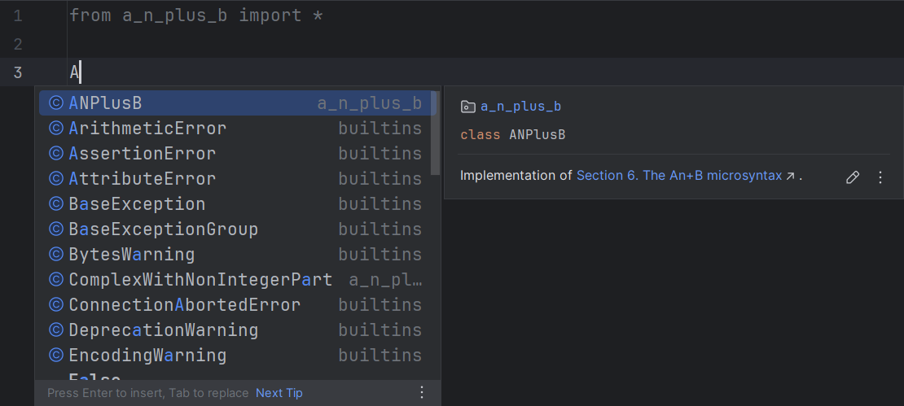

# LSP-specific configurations

## Tooltips

These options are not applied retroactively;
you need to make an edit to see the effect.

### Link error codes

Enable this option to display error codes as links.

Default: `false`

=== "Enabled"

    

=== "Disabled"

    

## Language server settings

These settings are not applied retroactively;
you need to [restart the server][1] to see the effect.

### Hover support

Uncheck this option to disable hover support.

Default: `true`

=== "Enabled"

    

=== "Disabled"

    

### Completion support

Check this option to enable completion support.

Default: `false`

=== "Enabled"

    

=== "Disabled"

    

### Go-to-definition support

Check this option to enable go-to-definition support.

Default: `false`

### Log level

!!! warning

    Language server logs are not recorded in `idea.log` by default.
    You need to manually [enable it][3].

Modify this option to make Pyright emit more or less [log messages][2].

Default: <i>Information</i>

  [1]: ../how-to.md#how-to-restart-the-language-server
  [2]: https://microsoft.github.io/language-server-protocol/specifications/lsp/3.17/specification/#window_logMessage
  [3]: ../how-to.md#how-to-enable-language-server-logging
